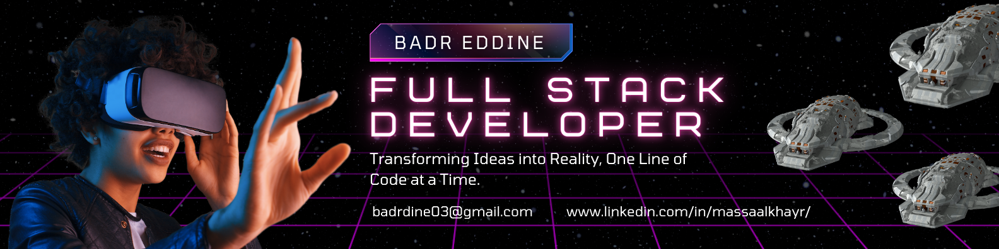

# Salut, je suis Badr Eddine, Développeur Full Stack 👋🏼

🌟 Passionné par le développement web et les solutions innovantes  
🎓 En formation de développement full stack à YouCode, Maroc (2024-2026)  
💼 Expérience en développement d'applications web et desktop  
🌍 Basé à Nador, Maroc

## 💻 Stack Technologique

## 🌟 Expériences

- **Stage chez Mesq Amin SARL** : Développement d'une application desktop de gestion logistique (C#, WinForms, SQL Server)
- **Photographe Publicitaire, Agence Oramid** : Photographies pour campagnes marketing et app de livraison

## 🌐 Langues

- Tamazight (Langue maternelle)
- Arabe (Courant)
- Anglais (Intermédiaire)
- Français (Moyen)
- Allemand (Moyen)

## 📫 Contact

- 📧 Email : badrdine03@gmail.com
- 🔗 LinkedIn : [www.linkedin.com/in/massaalkhayr/](www.linkedin.com/in/massaalkhayr/)
- 🌐 Portfolio : [Under Maintenence]

---

  

<picture>
  <source media="(prefers-color-scheme: dark)" srcset="https://raw.githubusercontent.com/B4drEddine0/B4drEddine0/output/github-snake-dark.svg" />
  <source media="(prefers-color-scheme: light)" srcset="https://raw.githubusercontent.com/B4drEddine0/B4drEddine0/output/github-snake.svg" />
  
</picture>
